# Identifying Emerging Markets in United Staes

## Project Proposal: Inner Emerging Economies Analysis

This project is uses financial technology analysis tools to find investment opportunities for emerging markets within the United States.
We are defining Emerging Markets to refer to US states which have lower than average personal incomes, but high rates of personal income growth in recent years.

The first step of the analysis will attempt to narrow down a shorter list of US states to focus the analysis on, and uses a combination of data of current personal income and growth of personal income in the last five years. The next step analyzes some sectors of these states to find which have been growing in recent years and have a good potential for continued growth.
The data sources used include bea.gov, census.gov, and kaggle.com. Some sectors we are interested in analyzing include tech, healthcare, finance, agriculture, manufacturing, transportation. The sectors that appear to have higher rates of recent growth in the states targetted for analysis will be highlighted.

The data is intended to be used to help investors identify markets to start companies in or expand existing operations into. The end result will be a presentation where investors can look at this data in an easy to use visual format, with a tool where they can pick an industry and see a display of the past five years of activity in that industry in each of the target states, and a ranking of those states in terms of their recent five year growth for that industry.

---
## Data Sources:

We used the United Staes Bureau of Economic Analysis API to get the last 5 year data of Personal Income in all the states. 

* [Bea.gov]( https://apps.bea.gov/API/signup/index.cfm) - Bureau of Economic Analysis

Furthermore, the population data to calculate the per capita growth in the states was obtained by donwloading a .csv file from the United States Cencus Bureau at:
* [Census.gov](https://www2.census.gov/programs-surveys/popest/datasets/2010-2020/state/totals/) - United Staes Census Bureau

Lastly, the GDP for each industry in all the states in the US was obtained by downloading a .csv file from Kaggle.com:
* [Kaggle.com](https://www.kaggle.com/davidbroberts/us-gdp-by-state-19972020/version/1) - A huge repository of community published data & code.

---
## Applications:

* Test a hypothesis:
    Is there a similar ranking within these states of overall growth and manufacturing growth?

* Answer questions:
    Which industries in these states seem to have taken bigger hits from 2020 with recovery opportunity, which seemed more resilient?
    Hypotheses related to this question:
        - Jobs with more work from home opportunity would have not taken as much of a hit
	    - Jobs involving travel, retail, restaurants, would have taken more of a hit
	    - Delivery services would have increased

* Identify markets with good investment opportunities:
		- State with highest growth in an industry the investor is involved in
        - State that took the biggest hit in 2020 in an industry, but is expected to recover

---

## Analysis:

## An overview of our Streamlit Dashboard

Annual Personal Income for all the states ranked in ascending order. The selectbox lets you select a year, to view the personal incomes for the states for that fiscal year. The red line on the map divides the map into two parts, the left of which identifies the 20 poorer states where we want to focus

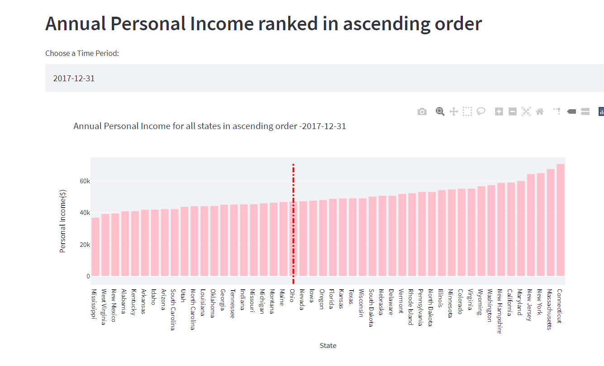

A general overview of the trends for Personal Income for all states for the past five year period. There are obvious bumps from the rounds of stimulus checks but there is still an upward general trend.

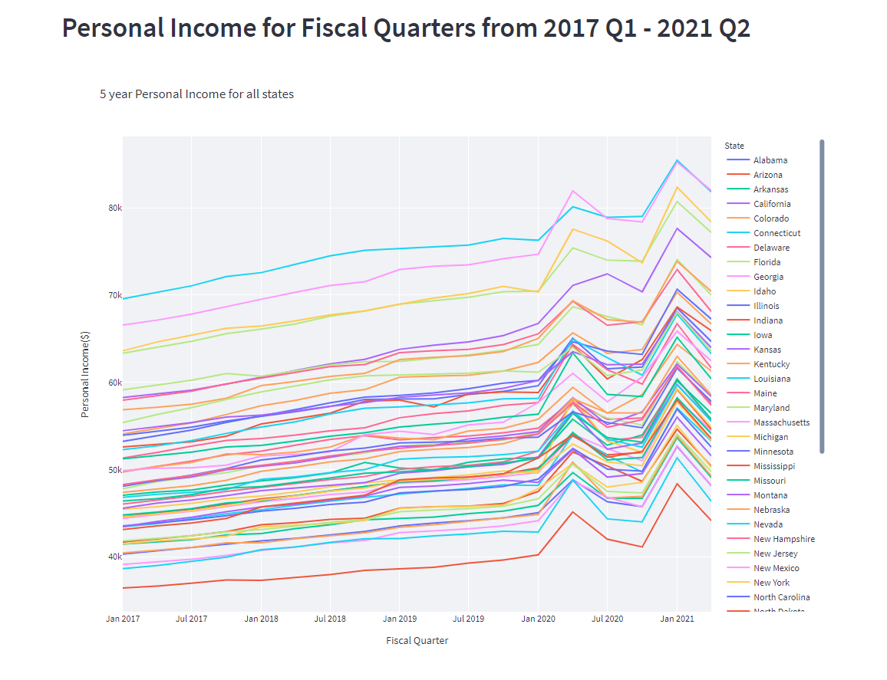


A choropleth map of the United states, color coded using the personal income data from 2021 Q2. The darker color represent the states with lower personal income

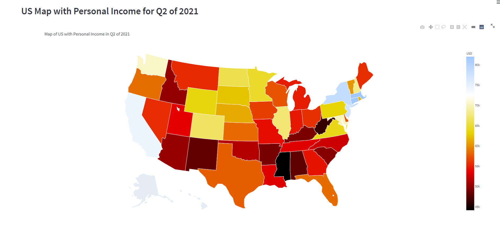

Percent Growth for all the states from 2017Q1 to 2021Q2 ranked in ascending order

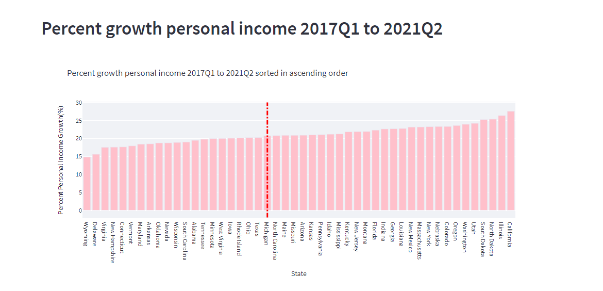

Personal Income plotted with percent growth for all the states. It shows an interesting trend. One of our hypotheses was that states with high personal income will have a higher growth percentage and vice versa. Overall, we expected the line plot of percent growth to be linear with a couple of anomalies. But we see there are some high income states like New Hampshire and Connecticut which show a very low rate of growth. Similarly there are some low income states like New Mexico and Utah which show impressive growth rates. <br> 
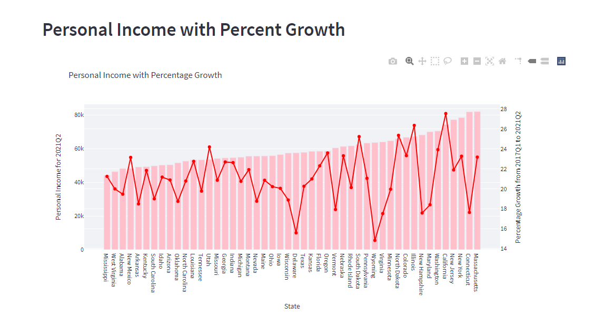


The following graph shows the singled out 20 of the lowest ranking States in personal income, then ranked based on the rate of growth of personal incomes in each one for the past five-year period

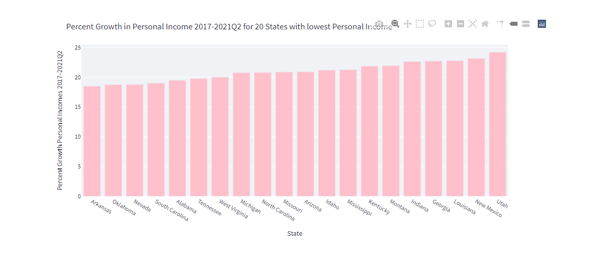

Chrolopleth Map of the targeted eight states with the highest rate of growth in personal incomes for the five year time period. The target states are:

* Georgia
* Indiana
* Kentucky
* Louisiana
* Mississippi
* Montana
* New Mexico
* Utah<br>

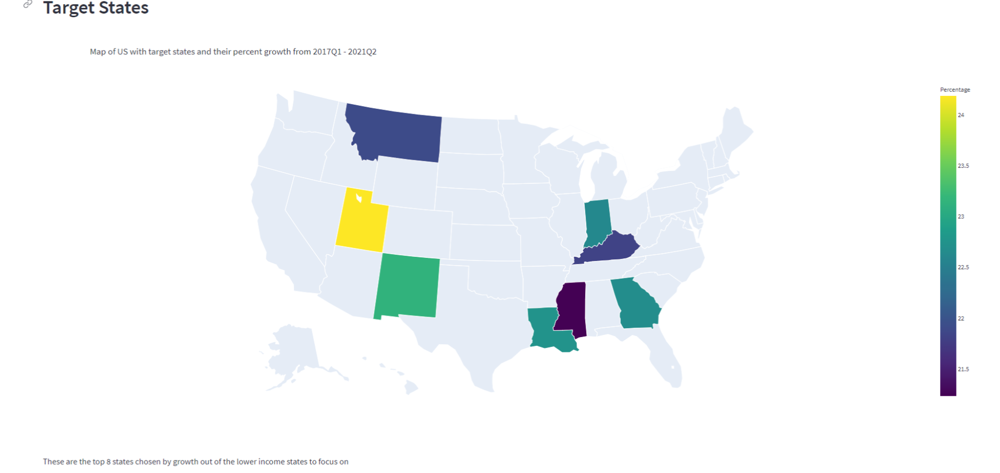

Following shows rankings of growth in the target states in the last five years in all the insustries, using bar charts. We see Utah has the highest growth percentage in the last 5 years. Based on our analysis, we can identify Utah as one of the best opportunities for investment based on recent growth.

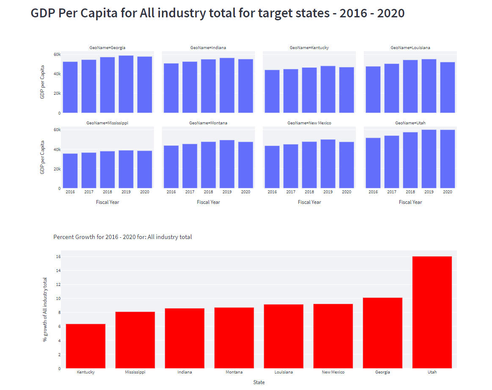

We identified 6 fast interesting sectors to test our hypotheses and identify states for investments in that sector. The sectors we analyzed are:
* Agriculture
* Healthcare
* Manufacturing
* Private Sector
* Finance
* Transportation<br>

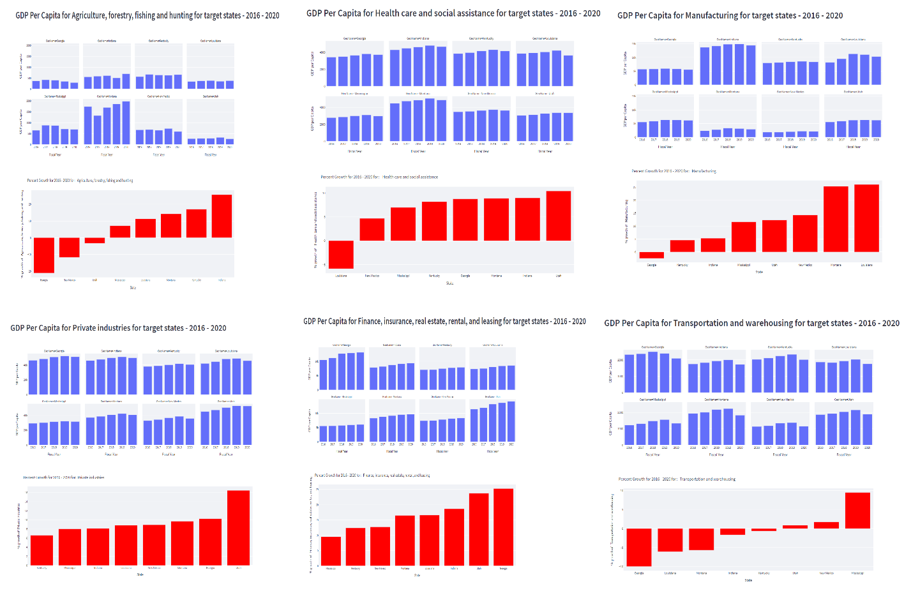

A dropdown select box where the user can select any industry they want get a gdp per capita analysis of that sector for the last five years in the target states, along with the growth rank of the target states for that sector based on the percent growth for the five year period. Our data set had missing values for some sectors for the year 2020, so the program was modified to filter out year 2020 if no data was available, to avoid the resulting skew. 

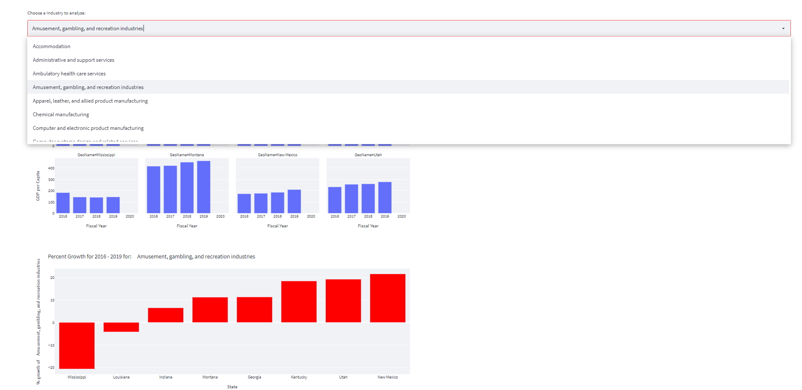

One of our Hypotheses was that the manufacturing industry is significant in driving the overall growth of a state, and thus one would expect the rankings of states analyzed with overall growth to be similar to the ranking of states by manufacturing growth. We can see from the following bar charts, that the overall growth percentage rank of a state is not strongly correlated with the manufacturing growth rate rank. 

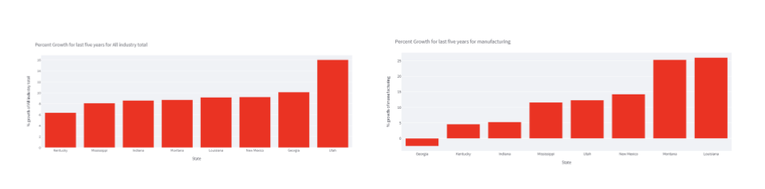

Other Hypotheses that we tested were:
    -Jobs with more work from home opportunity would have not taken as much of a hit in 2020
    -Jobs like transportation would have taken a bigger hit.

This Hypothese tested out to be true as is visible in the following image:

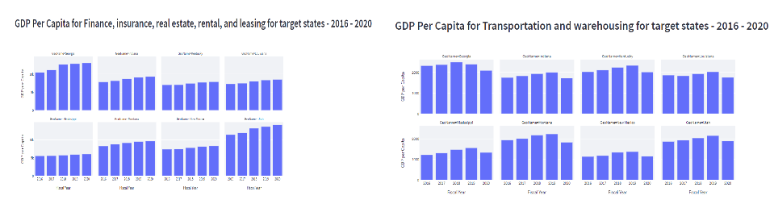 

---
## Future Additions / Next Steps
* Updating the program to work for new data as it comes out
* Finding a list of stocks associated with a particular sector and state that the user wants to look into
* Allow the user control over paratmeters to identify target states to analyze
* Analyze some non financial metrics like happiness for the target states
* Include some Pie graphs to view the percentage of various sectors in each state

---
## Technologies

This project uses python 3.7 along with the following packages:

* [JupyterLab](https://jupyterlab.readthedocs.io/en/stable/) - Web based user interface for data analysis.

* [pandas](https://github.com/pandas-dev/pandas) - Data analysis and manipulation library.

* [streamlit](https://streamlit.io/) - The fastest way to build and share data apps

* [plotly](https://plotly.com/) -  Developing standardds for AI and data science apps
---

## Installation Guide

Please install the following before starting the application

```python
  pip install pandas
  pip install plotly
  pip install streamlit
  pip install hvplot

```

Confirm installation by running:
```python
  conda list plotly
  conda list streamlit
```

Please acquire an API key from BEA.gov. It can be acquired here:
[Bureau of Economic Analysis API Key signup](https://apps.bea.gov/api/signup/index.cfm)

You will need to create a text file in the program folder labeled `.env` and containing your API key in the following format:

```BEA_API_KEY = "YOUR-API-KEY-HERE"```


---

## Usage
To use the inner_emerging_markets_analyzer tool, please download the folder in VS code and run it from command line using the following command

```python
streamlit run app.py
```

Additionally, we have included a jupyter lab file which was used in development. This could be used for future development or testing.

---

## Contributors

Preston Hodsman (phodsman@yahoo.com)

Thomas Leahy (thomasleahy6@gmail.com)

Abhishika Fatehpuria (abhishika@gmail.com)


---

## License

MIT
